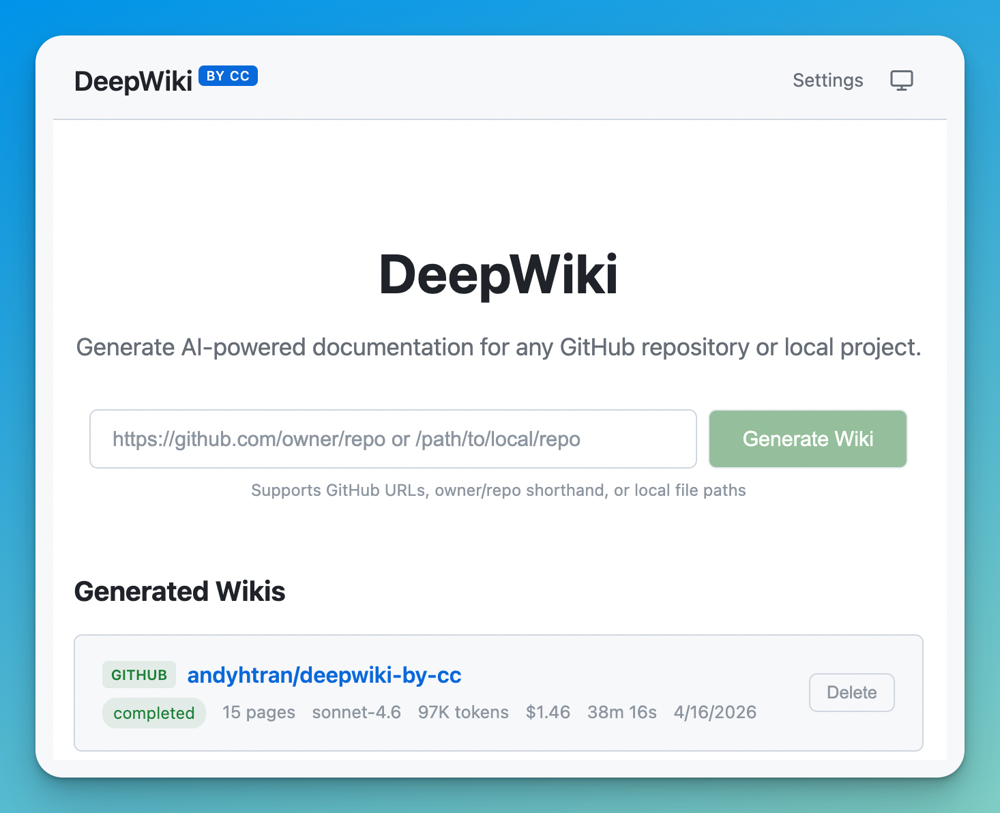
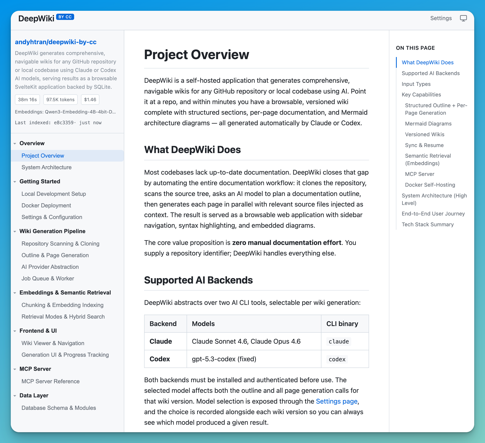

# DeepWiki

Generate comprehensive, navigable wikis for any GitHub repository or local codebase using Claude or Codex.

Point DeepWiki at a repo and it will clone it, scan the source files, generate a structured outline, and then write each page with an agent that explores the actual code — reading files, following imports, and searching for callers with read-only tools — before serving the result as a browsable wiki with Mermaid diagrams.

[](https://deepwiki.com/andyhtran/deepwiki-by-cc)


[Features](#features) · [Prerequisites](#prerequisites) · [Quick Start](#quick-start) · [How It Works](#how-it-works) · [Self-Hosting](#self-hosting-with-docker)

<p align="center">
  
</p>

## Features

- **Agentic page generation** — each page is written by an agent running inside the repo checkout with read-only tools (read, grep, glob). It starts from the outline's seed files, traces behavior across the codebase, and verifies claims against the code it actually read. Measurably deeper and more accurate than one-shot context injection ([eval results](docs/eval-results/2026-07-01-agentic-vs-injected.md)).
- **Claude or Codex** — pick between Claude Sonnet/Opus or Codex CLI (gpt-5.5) per wiki, with streaming progress and configurable page concurrency.
- **GitHub or local** — point at `owner/repo`, a full GitHub URL, or any local directory. `.gitignore`-aware scanning that filters out binaries, lock files, and generated code.
- **Structured output** — AI-generated outline with sections and pages, rendered with Mermaid diagrams, syntax highlighting, sidebar navigation, and a per-page table of contents.
- **Versioned wikis** — keep multiple versions per repo, each tagged with the model used to generate it. Switch between versions from the sidebar.
- **Sync & resume** — pull latest commits and agentically re-verify only the pages affected by the diff. Resume picks up where interrupted runs left off.
- **Built-in evals** — a benchmarking harness (deterministic metrics + LLM-judged QA and pairwise comparison) for proving pipeline changes actually improve wiki quality. See [docs/evals.md](docs/evals.md).
- **Self-hosted** — one-command Docker setup with persistent credential volumes, private-repo support via `GH_TOKEN`, and ~850 MB image footprint.

<p align="center">
  
  <br>
  <em>A generated wiki — sidebar navigation, per-page table of contents, Mermaid diagrams, and syntax-highlighted source references.</em>
</p>

## Prerequisites

- [Bun](https://bun.sh) runtime
- [Claude CLI](https://docs.anthropic.com/en/docs/claude-code) installed and authenticated (`claude` must be on your PATH) when using Claude models
- [Codex CLI](https://developers.openai.com/codex/cli/) installed and authenticated (`codex` must be on your PATH) when using the Codex model
- [Git](https://git-scm.com) and [GitHub CLI](https://cli.github.com) (`gh`) for cloning GitHub repos

## Quick Start

```bash
git clone https://github.com/andyhtran/deepwiki-by-cc.git
cd deepwiki-by-cc
bun install
bun run dev
```

Open [http://localhost:5173](http://localhost:5173), paste a GitHub URL (or `owner/repo`), and watch the wiki generate in real time.

### Local repositories

You can also point DeepWiki at a local directory:

```
/path/to/your/project
~/Code/my-project
./relative/path
```

## How It Works

1. **Clone & scan** — clones the repo (or reads a local directory), walks the file tree while respecting `.gitignore`, and filters out binaries, lock files, generated code, and minified bundles.
2. **Generate outline** — sends the file tree and README to the selected generation model, which returns a structured wiki outline with sections, pages, and seed file assignments.
3. **Generate pages agentically** — each page is written by an agent running inside the repo checkout, in parallel (configurable concurrency). The agent starts from the page's seed files, then explores with read-only tools — following imports, grepping for callers, checking configuration and defaults — before writing. Per-page spend and time caps bound the exploration. Mermaid diagrams are included where they help explain architecture or flow.
4. **Serve** — the wiki is stored in SQLite and served through a SvelteKit app with syntax highlighting, Mermaid rendering, a sidebar navigation tree, and a table of contents.

### Keeping wikis up to date

- **Sync** — pulls latest commits and selects only the pages whose source files were touched by the diff. Each affected page gets an agentic update pass: the agent reads the diff, inspects the updated checkout, and rewrites the page (or reports that no changes are needed). Page metadata (model, tokens, timing) is updated even when content doesn't change.
- **Resume** — if generation is interrupted or individual pages fail, resume picks up where it left off.
- **Regenerate** — full regeneration from scratch.

## Settings

Visit `/settings` in the UI to configure:

| Setting | Default | Options |
|---------|---------|---------|
| Model | Claude Sonnet 4.6 | Sonnet 4.6, Opus 4.6, gpt-5.5 (medium), gpt-5.5 (xhigh) |
| Parallel page limit | 2 | 1–5 |

When Codex is selected, DeepWiki uses `codex exec` with model `gpt-5.5` and the selected reasoning effort, exploring inside a read-only sandbox. (One quirk discovered along the way: `codex exec --output-schema` suppresses tool use entirely, so Codex page runs are schema-less and return the page as their final message.)

## Self-Hosting with Docker

```bash
git clone https://github.com/andyhtran/deepwiki-by-cc.git
cd deepwiki-by-cc
docker compose up -d
```

The web UI is served on port 8080.

### Authenticate Claude CLI (one-time)

The app uses model CLIs under the hood (Claude and optional Codex). Log in once inside the container — credentials are persisted in a Docker volume so you won't need to do this again.

```bash
docker compose exec deepwiki claude login
```

Follow the prompts to authenticate. Then verify it worked:

```bash
docker compose exec deepwiki claude -p "say hello" --max-turns 1
```

If you get a response, DeepWiki is ready at [http://localhost:8080](http://localhost:8080).

If you plan to use the Codex model, authenticate that CLI once as well:

```bash
docker compose exec deepwiki codex login
```

### Private repositories (optional)

To generate wikis for private GitHub repos, create a `.env.docker` file:

```bash
GH_TOKEN=ghp_...
```

Then restart:

```bash
docker compose up -d
```

### Resource usage

| | Size |
|---|---|
| Docker image | ~850 MB (includes Node.js, Git, GitHub CLI, Claude CLI, Codex CLI) |
| Memory at idle | ~30 MB |
| Memory during generation | ~100–200 MB (varies with repo size and page concurrency) |

### Rebuilding after updates

```bash
git pull
docker compose up -d --build
```

## Development

```bash
bun run dev       # Start dev server
bun test          # Run tests
bun run lint      # Lint (Biome)
bun run check     # Type check
bun run build     # Production build
bun run start     # Start production server (port 8080)
```

Wiki quality is measured with a local eval harness (`just eval <label>`) — deterministic metrics plus LLM-judged QA and pairwise comparison against golden repos pinned to fixed commits. See [docs/evals.md](docs/evals.md).

## Tech Stack

- **Frontend**: SvelteKit 5, Mermaid, highlight.js
- **Backend**: SvelteKit server routes, SQLite (better-sqlite3), background job queue
- **AI**: Claude CLI and Codex CLI (subprocess with streaming JSON output)

## License

[MIT](LICENSE)
